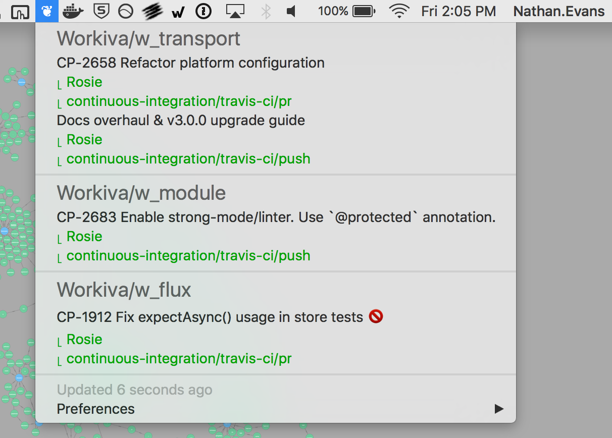

Prowler
=======
*Prowl your PRs*

Use prowler to get a quick overview of the state of your PRs.

Quickly jump to 
* merge conflicts
* failing CI runs



## Setup
1) Allow app downloaded from anywhere (System Preferences > Security & Privacy)

2) [Create an API token on Github](https://github.com/settings/tokens) for Prowler to use.

3) [Create a config](###Config) with the settings Prowler should use, save it to ~/.prowler.conf

4) Unzip the latest Prowler release and move it to your Applications

5) Start Prowler

## Usage
Click on the title to go to the PR.

Click on the CI labels to go to the CI.

Labels marked in YELLOW are currently running CIs.

Labels marked in RED are failed CI runs.

Labels marked in GREEN are passing CI runs.

Titles marked with a red circle and bar have merge conflicts.

## Config
Example
```
{
  "username" : "de1ux",
  "repos" : [ "Workiva/w_flux", "Workiva/w_transport", "Workiva/w_module" ],
  "token" : "2jk412jlk151lkj1jl1bjk51l21klj1j1jl1n1k1",
  "services" : [ "jenkins", "travis-ci" ],
  "successStates" : [ "success" ],
  "pendingStates" : [ "pending" ],
  "failureStates" : [ "failure", "failed", "error" ],
  "hideMergeConflicts": false,
  "showAllPrs": false,
}
```

#### username
```
String: Github username the token has been generated under
```

#### repos
```
List<String>: List in the form of owner/repository.
              The repos Prowler should search for PRs in.
```

#### services
```
List<String>: The CI services that Prowler should monitor on PRs.
              Examples: jenkins, travis-ci
```

#### successStates
```
List<String>: The list of successful states that the CI services can enter.
              Examples: success, successful, succeeded
```

#### pendingStates
```
List<String>: The list of pending states that the CI services can enter.
              Examples: pending, queued, waiting
```

#### failureStates
```
List<String>: The list of failure states that the CI services can enter.
              Examples: failure, failed, error
```

#### hideMergeConflicts
```
bool: Whether to display merge conflicts, if any, on your PRs
```

#### showAllPrs
```
bool: True if you want to see ALL PRs in your repos. False shows only
      your PRs.
```

## Thanks
[Workiva](https://www.workiva.com/)

[BitBar](https://github.com/matryer/bitbar)
